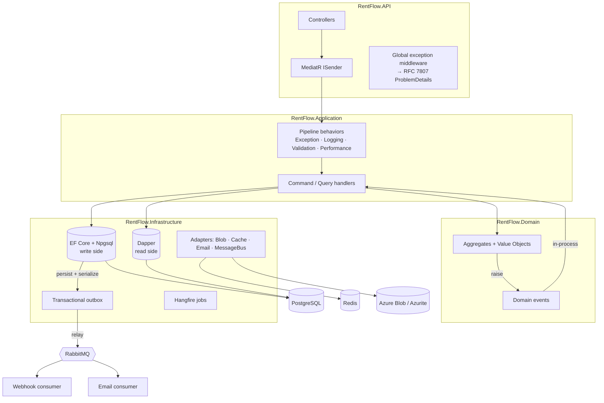
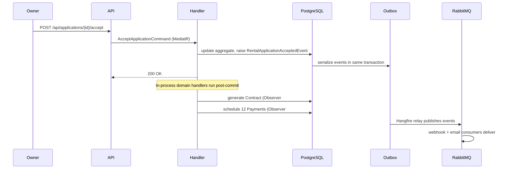
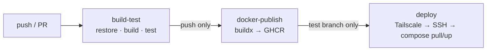

# RentFlow

A production-quality **real-estate rental platform API** built with ASP.NET Core and
.NET 10, designed as a portfolio piece to demonstrate modern backend engineering:
Clean Architecture, CQRS, domain events, the transactional outbox pattern, and a
fully containerized, CI/CD-driven deployment.

> **Live demo:**
> [API docs (Scalar)](https://rentflow.tail07363d.ts.net/scalar/v1) &nbsp;·&nbsp;
> [Health](https://rentflow.tail07363d.ts.net/health)
>
> _Self-hosted on a home server and exposed over HTTPS via a Tailscale Funnel — best-effort availability._

---

## Overview

RentFlow models the full lifecycle of renting a property:

- **Owners** publish property listings.
- **Tenants** browse listings and submit rental applications.
- **Owners** accept or reject applications.
- On acceptance, a **contract** is generated automatically (with a rendered document
  uploaded to blob storage) and a **12-month payment schedule** is created.
- **Background jobs** flag overdue payments and expire ended contracts.
- **External systems** are notified of status changes via signed **webhooks**, and
  **email notifications** are sent — both asynchronously through RabbitMQ.

The emphasis is not the domain itself but the **engineering around it**: a layered,
testable architecture; a clean read/write split; resilient integrations; and an
automated path from `git push` to a running container on a server.

## Key characteristics

- **Clean Architecture** — Domain, Application, Infrastructure, API; dependencies point inward.
- **CQRS** — writes go through EF Core aggregates; reads use hand-written Dapper queries.
- **Domain events** drive side effects (contract generation, payment scheduling) in-process,
  and a **transactional outbox** guarantees at-least-once delivery to RabbitMQ.
- **Fail-open integrations** — Redis, Azure Blob, RabbitMQ and SMTP each degrade gracefully:
  if the dependency isn't configured or is down, the app stays healthy using a no-op/local
  fallback instead of crashing. This is what lets the same build run locally, in Docker, and in CI.
- **Fully containerized** and deployed continuously via GitHub Actions.

---

## Architecture



The dependency rule is strict: **Domain** knows nothing of the outside; **Application**
depends only on Domain abstractions; **Infrastructure** and **API** implement and compose them.

### Request lifecycle (application acceptance)



---

## Tech stack

| Area | Technology |
|------|-----------|
| Runtime | .NET 10 / ASP.NET Core |
| Write data access | EF Core 10 + `Npgsql` (PostgreSQL) |
| Read data access | Dapper (hand-written SQL, paged search) |
| CQRS / mediation | MediatR + pipeline behaviors |
| Validation | FluentValidation (via pipeline behavior) |
| Mapping | AutoMapper |
| Auth | ASP.NET Core Identity, JWT access + rotating refresh tokens, role-based (Admin/Owner/Tenant) |
| Caching | Redis (`StackExchange.Redis`), cache-aside + version-counter invalidation |
| Messaging | RabbitMQ (`RabbitMQ.Client` async API), topic exchange |
| Reliability | Transactional Outbox pattern |
| Background jobs | Hangfire (`Hangfire.PostgreSql`) |
| File storage | Azure Blob (`Azure.Storage.Blobs`) / local-file fallback |
| Email | MailKit (SMTP) / logging fallback |
| API docs | OpenAPI + Scalar |
| Logging | Serilog (structured) |
| Health | ASP.NET Core Health Checks (`/health`) |
| Testing | xUnit, Moq, Testcontainers (PostgreSQL) |
| Packaging | Docker (multi-stage), Docker Compose |
| CI/CD | GitHub Actions → GHCR → self-hosted deploy over Tailscale |

All third-party packages are free/OSS. Dependency versions are centralized via
**Central Package Management** (`Directory.Packages.props`).

---

## Design patterns and where they live

| Pattern | Where |
|---------|-------|
| **Mediator** | MediatR — every action is a `Command`/`Query` with a dedicated handler |
| **CQRS** | EF Core write side vs. Dapper read side, separate models |
| **Repository + Unit of Work** | `Repository<T>`, concrete write repos, `EfUnitOfWork` |
| **Factory** | Aggregate creation — `Property.Create()`, `RentalApplication.Create()`, … |
| **Builder** | `PropertySearchQueryBuilder` composes dynamic Dapper search SQL |
| **Decorator / Chain of Responsibility** | MediatR pipeline behaviors: Exception → Logging → Validation → Performance → handler |
| **Adapter** | `IDocumentStorage`, `ICacheService`, `IEmailSender`, `IMessageBusPublisher` wrap external services with fail-open fallbacks |
| **Observer** | Domain-event handlers (contract generation, payment scheduling) + RabbitMQ webhook/email consumers |
| **Outbox** | `OutboxMessage` written in the same transaction as domain changes, relayed to RabbitMQ by a Hangfire job |

---

## Getting started

### Prerequisites
- [Docker](https://www.docker.com/) + Docker Compose

### Run the full stack
```bash
# from the repo root
docker compose up -d --build
```

This starts the API plus PostgreSQL, Redis, RabbitMQ, Azurite (blob emulator) and
Mailpit (SMTP catcher). Migrations are applied automatically on startup.

| Service | URL |
|---------|-----|
| API health | http://localhost:8080/health |
| API docs (Scalar) | http://localhost:8080/scalar/v1 |
| Hangfire dashboard | http://localhost:8080/hangfire |
| Mailpit (captured email) | http://localhost:8025 |
| RabbitMQ management | http://localhost:15672 (guest/guest) |

> The image is **fail-open**: with no Redis/Blob/RabbitMQ/SMTP configured it still boots
> and serves requests using local/no-op fallbacks.

### Environments
- **Development** — default; Swagger/Scalar/Hangfire enabled, Azurite for blob.
- **Test** — `ASPNETCORE_ENVIRONMENT=Test` (`docker-compose.test.yml`); uses the
  `rentflow_test` database and reads the JWT signing key from a gitignored `.env`
  (see `.env.example`). This is the profile deployed by CI/CD.

---

## API overview

All endpoints are under `/api`. Authentication is JWT bearer; obtain a token via
`/api/auth/login`. Roles: **Admin**, **Owner**, **Tenant**.

| Area | Method & route | Auth |
|------|----------------|------|
| **Auth** | `POST /api/auth/register` · `login` · `refresh` · `logout` · `GET /api/auth/me` | public / bearer |
| **Properties** | `GET /api/properties` (search) · `GET /api/properties/{id}` | public |
| | `POST /api/properties` · `PUT {id}` · `POST {id}/publish` · `{id}/unlist` · `DELETE {id}` | Owner/Admin |
| **Applications** | `POST /api/applications` · `POST {id}/withdraw` | Tenant |
| | `GET /api/applications/mine` | Tenant |
| | `GET /api/applications/{id}` | parties |
| | `GET /api/properties/{id}/applications` · `POST {id}/accept` · `{id}/reject` | Owner/Admin |
| **Contracts** | `GET /api/contracts/{id}` · `GET /api/contracts/mine` · `GET /api/properties/{id}/contracts` · `POST {id}/terminate` | parties |
| **Payments** | `GET /api/payments/{id}` · `GET /api/payments/mine` · `GET /api/contracts/{id}/payments` · `POST {id}/pay` | parties |
| **Webhooks** | `POST /api/webhooks` · `GET mine` · `GET {id}` · `PUT {id}` · `POST {id}/activate` · `{id}/deactivate` · `DELETE {id}` | Owner/Admin |

Explore and try every endpoint interactively in the [Scalar UI](https://rentflow.tail07363d.ts.net/scalar/v1).

---

## Testing

```bash
dotnet test RentFlow.slnx
```

- **Unit tests** (xUnit + Moq) cover domain invariants/transitions, application handlers
  (happy path + NotFound/Forbidden/Conflict, asserting no save on auth failure), validators,
  and pure infrastructure helpers.
- **Integration tests** spin up a real PostgreSQL via **Testcontainers**, apply EF migrations,
  and verify the EF-write → Dapper-read round trip (Docker required).

---

## CI/CD

A single GitHub Actions workflow (`.github/workflows/ci-cd.yml`):



1. **build-test** — restores, builds in Release, and runs the full test suite
   (integration tests use Testcontainers on the Docker-enabled runner).
2. **docker-publish** — builds the multi-stage image and pushes it to
   **GitHub Container Registry** (`ghcr.io/andrija99-dev/rentflow`), tagged by branch/SHA/`latest`.
3. **deploy** *(only on the `test` branch)* — the runner joins a **Tailscale** tailnet,
   copies the compose files to the self-hosted server, and runs `docker compose pull && up -d`.
   Tailscale provides connectivity to the home server behind CGNAT **without exposing any
   inbound ports** to the public internet.

---

## Git branching strategy (Gitflow)

| Branch | Purpose |
|--------|---------|
| `main` | production-ready releases |
| `test` | staging / QA — the deploy target |
| `dev` | integration branch |
| `feature/*` | one branch per feature, branched from and `--no-ff` merged back into `dev` |

The project was built strictly one `feature/*` branch at a time (15 feature branches plus
a few ad-hoc ones), each merged with `--no-ff` to preserve history, following
[Conventional Commits](https://www.conventionalcommits.org/).

---

## Project structure

```
src/
├── RentFlow.Domain/          # entities, value objects, domain events, interfaces
├── RentFlow.Application/      # CQRS handlers, validators, behaviors, mappings, abstractions
├── RentFlow.Infrastructure/   # EF Core, Dapper, outbox, Hangfire, messaging, storage, email
└── RentFlow.API/             # controllers, middleware, composition root
tests/
├── RentFlow.UnitTests/
└── RentFlow.IntegrationTests/
docker-compose.yml             # full local stack
docker-compose.test.yml        # Test-environment override
docker-compose.deploy.yml      # pull prebuilt GHCR image (used on the server)
Dockerfile                     # multi-stage build
.github/workflows/ci-cd.yml    # build → publish → deploy
```
